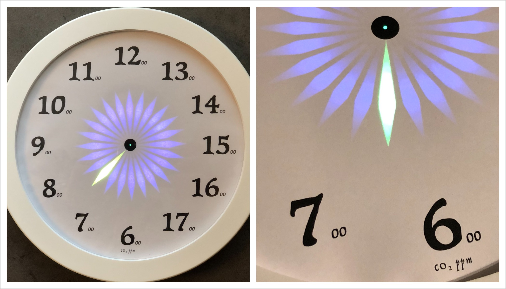
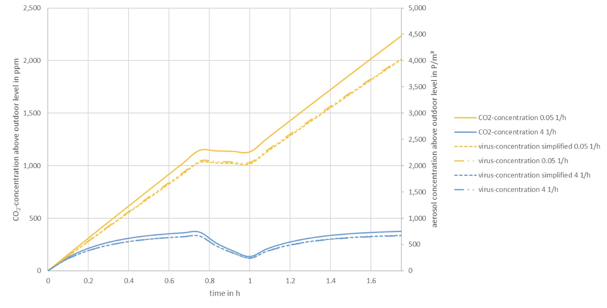
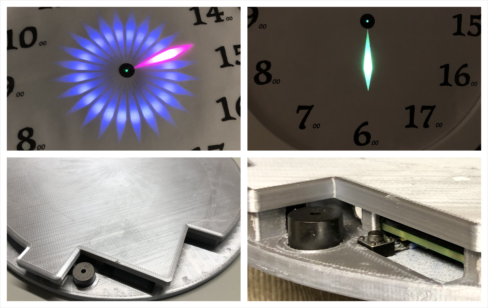
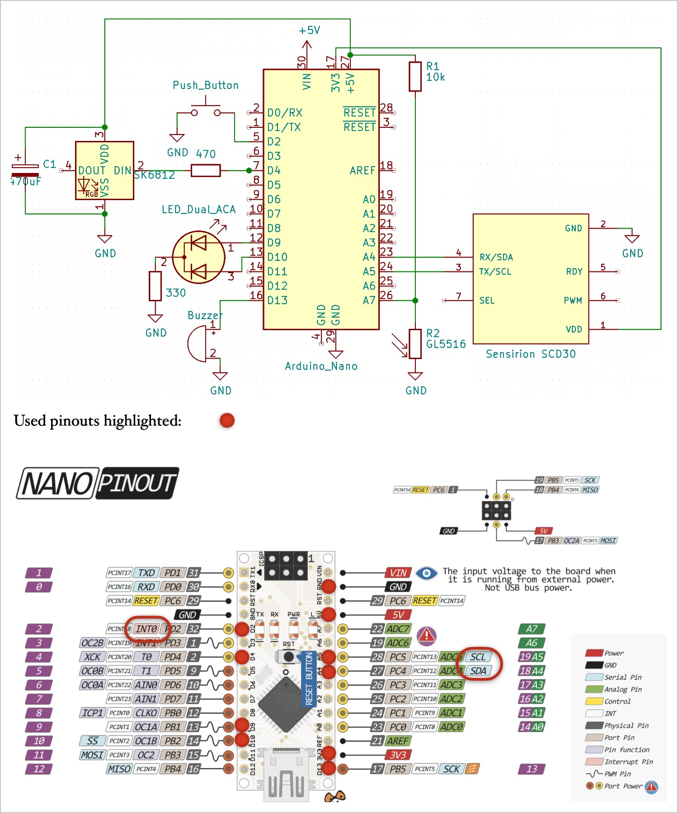
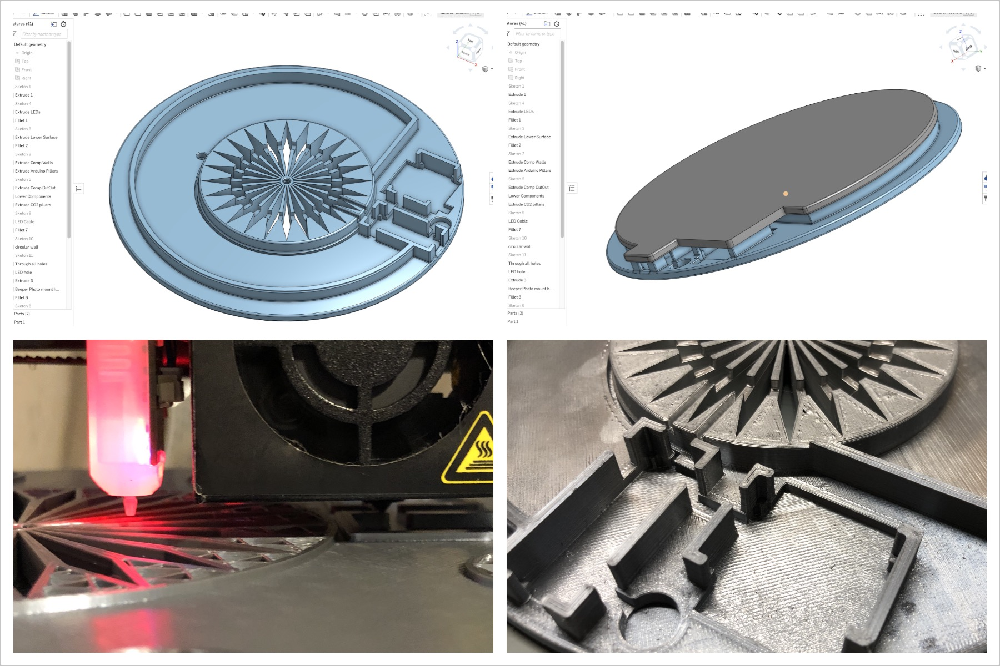
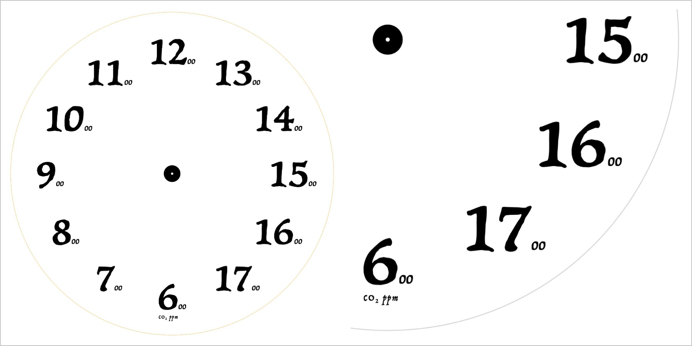
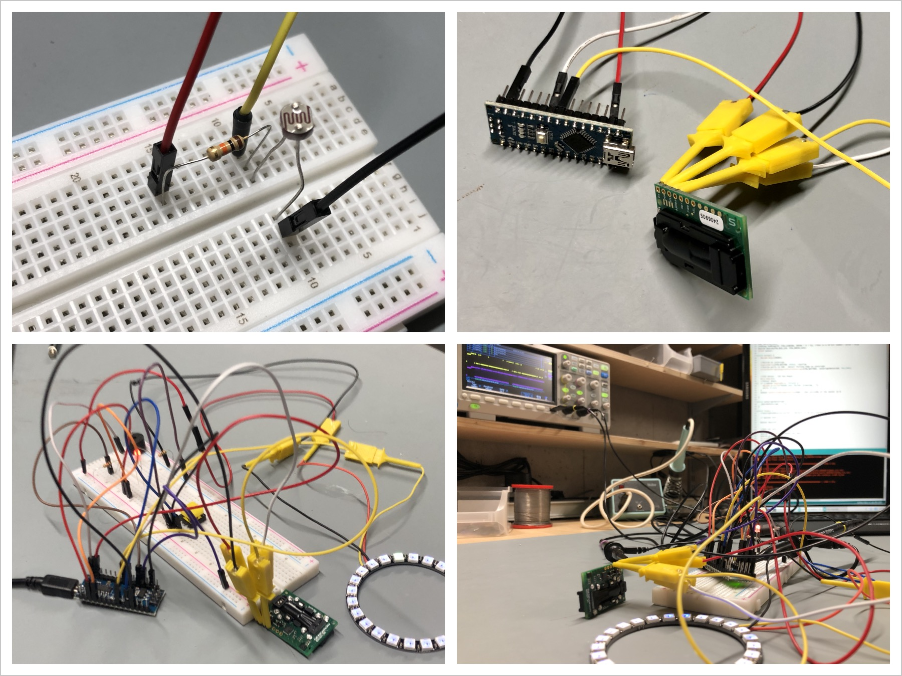
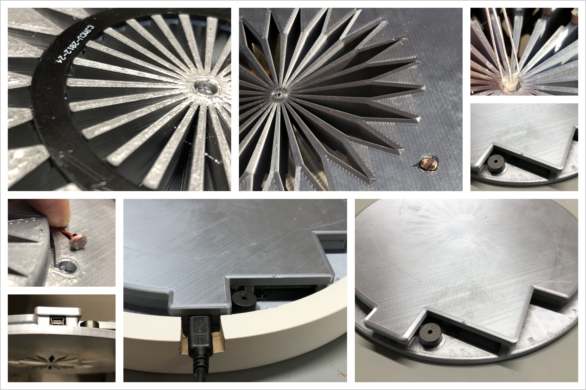

<meta name="google-site-verification" content="mVb4j9CEitCwDcsNqLN-e2j8hI3UwMoKpGTOJ4NhaoY" />
# CO2 Wall Clock 
## Arduino / ESP powered CO2 Monitor for Schools, Offices, and Private Buildings
### Proper ventilation not only ensures well-being, but significantly reduces risk of SARS-CoV-2 infection

## Background
“Aerosols are a possible transmission path of the novel coronavirus. Aerosols spread quickly throughout the entire room, especially in closed indoor spaces. Regular ventilation by shock and cross ventilation or via ventilation systems can significantly reduce the risk of infection with SARS-CoV-2.” [[Source]](https://www.umweltbundesamt.de/en/press/pressinformation/proper-airing-reduces-risk-of-sars-cov-2-infection)

Every person is emitting CO2 as well as aerosols while breathing. CO2 concentration correlates with the aerosol and thus virus concentration. CO2 is also a good indicator for the efficiency of the ventilation. 

  
Figue: Modelling Co2 concentration (solid) and virus load (dotted) in a classroom with (blue) and without ventilation (yellow). <a href="https://depositonce.tu-berlin.de/bitstream/11303/11478.3/9/hartmann_kriegel_2020_en_v3.pdf">[Source: http://dx.doi.org/10.14279/depositonce-10362.3]</a>

## Why a CO2 Monitor? 
We can all assess and gauge air quality when entering a room (from the outside). However, humans have no means to objectively judge air quality after a short time, given our senses adapt quickly to a situation [Source](https://en.wikipedia.org/wiki/Neural_adaptation). Most people do not even notice the incremental worsening of air quality and see no good reason to vent a room often.

Air quality cannot be measured directly, but CO2 concentration is the most important proxy. Outside air has typically CO2 concentration of around 410 ppm. The concentration of exhaled CO2 is in the excess of approx. 38’000 ppm. Indoor CO2 level considered acceptable is 1’000 ppm, a level that is reached in a room quickly [Source](https://en.wikipedia.org/wiki/Indoor_air_quality)

A CO2 monitor helps to keep a room well-vented and is thought a mandatory utility during the pandemic.

## Design Considerations 
Most CO2 monitors use a (small) digital display that requires your attention to read the CO2 concentration. In this design the concept of a wall clock was chosen for direct visual feedback and intuitive reading. It is well suited for schools, offices and private buildings.

Indoors, concentrations below 600 ppm are of short nature, and exceeding 1’000 ppm suggests inadequate ventilation. Therefore the range from 600-1750 ppm is more than sufficient for indoor operation. 

Moreover, the ppm concentration is color coded and shall relate to the importance to air the room; green-amber-red-purple. 

In the center of the watch face a red/green status LED indicates if a warning buzzer is active or not. If active, the buzzer sends a 50 ms signal every 3 minutes when hitting 1000 ppm, and with increasing concentration warns more often; at 1'750 ppm the buzzer is activated every 10 seconds. 

The buzzer can be turned off/on with a small button that is located nearby the buzzer. Recommen-dation is to keep the buzzer active at all times. 

## Features
- **Accurate:** NDIR CO2 sensor with +/-30ppm +5ppm (calibrated)
- **Visual:** Display CO2 concentration on a watch face. Range: <=6 to >=17.5 (x100ppm) 
- **Intuitive:** RGB LED relates to CO2 ppm concentration (green-amber-red-purple) 
- **24/7 Operation:** Light sensitive resistor (LDR) adapts brightness of LEDs 
- **Audible:** Integrated buzzer warns when reaching 1000 ppm 
- **Do Not Disturb:** Buzzer can be switched on/off with status LED on watch face

## Parts List (~100€)
- Picture Frame (~10€): https://www.amazon.de/dp/B07D4MQ9ZR
- Arduino Nano v3.0 Microcontroller Board (clone) (~6€): https://www.amazon.de/dp/B078SBBST6/
- High-precision Sensor: Sensirion SCD 30 (~50€): https://shop.watterott.com/Sensirion-SCD30-CO2-Kohlendioxid-Sensor
- 24 NeoPixel LED ring WS2812 (Adafruit) 5.3 cm (~11€): https://www.amazon.de/dp/B07QLMPV6S
- 3 mm dual color red/green 3 pin LED (Common Cathode LED) (~1€)
- Resistors: 1x 330Ω, 1x470Ω, 1x10kΩ (<1€)
- Capacitor: 470-1000µF/6.3V (<1€)
- Light Sensitive Resistor: Light: 20-30 KΩ. Darkness: 1 MΩ (~1€)
- Push Button Switch 6x6mm (<1€)
- Buzzer (<1€)
- Micro USB power supply (~5€)
- PLS or PETG 3D Printed watch face and backdrop (~5€)

## Schematics & Design Considerations
- Button needs to be connected to an Arduino pin supporting interrupts (D2 or D3).
- Sensirion SCD 30 can be read-out via PWM, Modbus, or via an I2C bus (used here). [Datasheet](https://www.sensirion.com/fileadmin/user_upload/customers/sensirion/Dokumente/9.5_CO2/Sensirion_CO2_Sensors_SCD30_Datasheet.pdf)
- Data input of Adafruit Neo Pixel LED ring shall be protected with a 470Ω resistor, and DC connection buffered with a 470-1000 µF capacitor. 
- Buzzer is driven directly by low power Arduino output. For more power, a MOSFET driver circuit could be integrated.  
- Schmatic and wiring diagram below, incl. a pinout of the used Arduino Nano.

## 3D CAD Design & 3D Print
- Designed for LEDs to function like an “analogue wach”, hosting all components, while fitting into the picture frame. CO2 sensor mount with open air vents. Design principle: “quick & dirty”, but functional ;)
- Print with silver-like PLA. Do not use white, otherwise LED chamber separation is not perfect due to some translucency. 
- Link to my 3D CAD design: [Onshape](https://cad.onshape.com/documents/eb4fe6fd7e007a0c0a804747/w/9b61381e8207a3fee56fc157/e/aed4f8af9d3ca59d0a31d5e0) Branches: Arduino & ESP - choose the right one for your purpose.
- Link to STLs: [3D_STL_Files](3D_STL_Files/) for Arduino and ESP8266 (the latter has not been printed/tested)

## Watch Face Design
- Link to pdf and Apple Keynote file: [2D Design Files](2D_Watchface/)
- Best printed on semi-transparent paper; cut-out and place in front of 3D print

## Component Test
It is strongly advised to wire up the components step-by-step, and testing each added functionaly with the debug code snippets in the ino file. After each functional entity is tested, the full assembly is fully operational on a breadboard. At this point the transfer into the 3D printed housing can begin :)  

## Assembly

## Operation

#### Power
The Arduino boad is placed in such a way that the Micro USB connection can be used to power the CO2 Watch 

#### 24/7 Operation
Ambient brightness is measured and LEDs adapt to the given lighting situation, so the CO2 Watch can do its job 24/7.

#### Where to place? 
Install away from windows and  doors and do not place within the proximity of people (>1 m).

# License Information

## Concept, 3D Print, 2D Watch Face 

Project files such as 3D Print and 2D Design and Concept files are released under [Creative Commons Share-alike 4.0 International](http://creativecommons.org/licenses/by-sa/4.0/)

Note: Below is a human-readable summary of and not a substitute for the [license](http://creativecommons.org/licenses/by-sa/4.0/legalcode)

#### You are free to:

- Share — copy and redistribute the material in any medium or format
- Adapt — remix, transform, and build upon the material for any purpose, even commercially.

The licensor cannot revoke these freedoms as long as you follow the license terms.

#### Under the following terms:

- Attribution — You must give appropriate credit, provide a link to the license, and indicate if changes were made. You may do so in any reasonable manner, but not in any way that suggests the licensor endorses you or your use.
- ShareAlike — If you remix, transform, or build upon the material, you must distribute your contributions under the same license as the original.
- No additional restrictions — You may not apply legal terms or technological measures that legally restrict others from doing anything the license permits.

## Software Code 

**Software is released under the MIT License (http://opensource.org/licenses/MIT).**

The MIT License (MIT)

Copyright (c) 2020 Markus Brosch

Permission is hereby granted, free of charge, to any person obtaining a copy
of this software and associated documentation files (the "Software"), to deal
in the Software without restriction, including without limitation the rights
to use, copy, modify, merge, publish, distribute, sublicense, and/or sell
copies of the Software, and to permit persons to whom the Software is
furnished to do so, subject to the following conditions:

The above copyright notice and this permission notice shall be included in all copies or substantial portions of the Software.

THE SOFTWARE IS PROVIDED "AS IS", WITHOUT WARRANTY OF ANY KIND, EXPRESS OR
IMPLIED, INCLUDING BUT NOT LIMITED TO THE WARRANTIES OF MERCHANTABILITY,
FITNESS FOR A PARTICULAR PURPOSE AND NONINFRINGEMENT. IN NO EVENT SHALL THE
AUTHORS OR COPYRIGHT HOLDERS BE LIABLE FOR ANY CLAIM, DAMAGES OR OTHER
LIABILITY, WHETHER IN AN ACTION OF CONTRACT, TORT OR OTHERWISE, ARISING FROM,
OUT OF OR IN CONNECTION WITH THE SOFTWARE OR THE USE OR OTHER DEALINGS IN THE
SOFTWARE.
